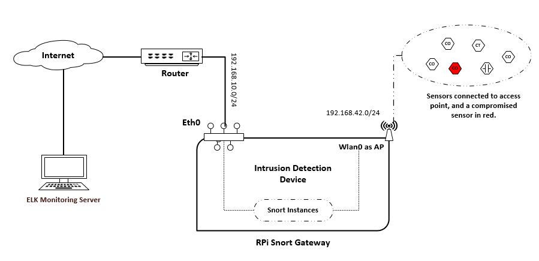

## Description
Intrusion detection system using open source tools Snort and Elastic Stack. It utilizes RPi integrated Wi-Fi as an access point to provide connectivity to wireless devices e.g. IoTs etc. To capture traffic from ethernet devices connected to router, you might have to use port mirroring which is not included in this project. In abstract, following is the conceptual design:


  


1. Interface eth0 of RPi has subnet of 192.168.10.0/24
2. Wlan0 is configured as access point, is on 192.168.42.0/24 subnet
3. ELK stack is on OpenStack as monitoring server
 
## Tools specification
- A SoC with 4 with 8GB of RAM minimum
- A capable broadband router
- Ubuntu / Debian image as ELK server
- Hostapd to configure integrated wifi as access point
- Isc-dhcp-server to provide ip-pool to access point
- Snort latest version
- Several comments are given inside code files for debugging if needed
## Instructions
**NOTE**: It may sound good to just run a single script to setup everything, but Arm architecture is a bit of tricky. For easy debugging it is better to run separate code files. 
1. Run ```bash Snort_install.sh```  to install and configure Snort on RPi. Have a look into code in case of errors.
2. Run ```bash Beats_setup.sh```  to setup beats in order to ship Snort logs and system metrics to ELK server. Due to RPi Arm architecture, there are several dependencies and expect errors in this phase. If you have ```go``` installed using apt-get then remove it, also for current (04/04/2019) beats repo https://github.com/elastic/beats , ```make``` does not generate any binary neither error.   You can download an older repo from https://drive.google.com/file/d/1C2S769YoNrTLPcDeRk1nMQLTZKBE--YV/view?usp=sharing  (```wget``` may not work on google drive) extract in home directory (/home/pi in my case) and reexport paths (have a look inside code file!) . A sample ```filebeat.yml``` is also added.    
3. Run ```bash Wlan_setup.sh``` to configure hostapd and isc-dhcp-server. Make sure your wlan0 interface is working.
4. Run ```bash Elastic_install.sh``` on ELK server. Setting up Logstash might cost some time. For Snort grok patterns, have a look at this project https://github.com/robcowart/synesis_lite_snort  for detailed snort patterns.  If you are using openStack, make sure ports are open in security settings.


